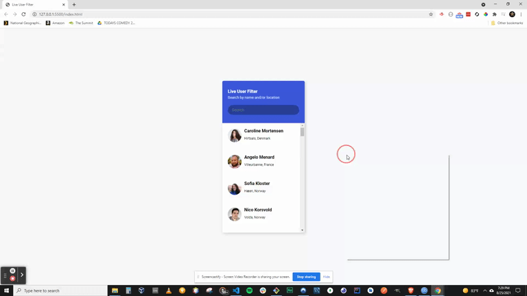

# VANILLA.JS - Live User Filter

### Live Demo

https://l1ve.netlify.app/

### About

In this project we create a live user filter. When given a simulated friends list of people currently online, the user can enter name values to search the list, and eliminate people from the list who don't match the search value characters.

